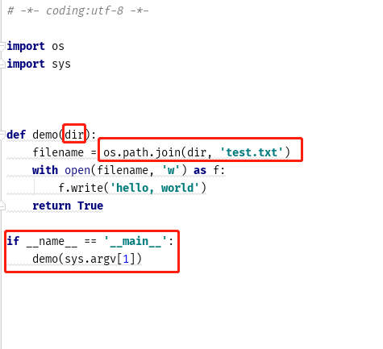
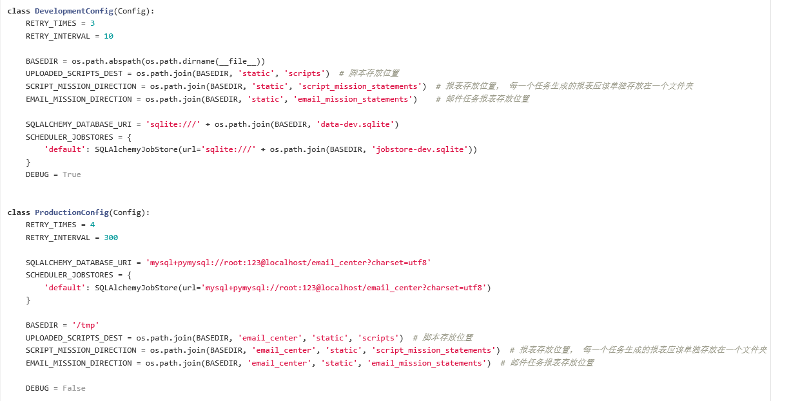

#### 2019.03.08新增
#### 
现在将正文编辑的可用选项添加到了正文模态框里了.
#### 
新增了用户自定义模板的功能, 模板的规则遵循jinja2语法, 初始传入的参数有2个:filename 生成的报表文件名(不包括后缀), tables: (sheetname, datafram_table)二元元组组成的列表.
```
jinja2 语法介绍
# 注释, 不会显示到邮件中
{# 注释内容 #}
# if else语句
.........
# for循环
...
# 取值
{{ 变量名 }}
```
一般情况下使用上面的语句应该足够定义模板, 如果需要了解更详细的jinja2语法内容, 可以访问<a href="http://docs.jinkan.org/docs/jinja2/templates.html">
官方文档</a>进行查看


#### 2019.03.06更新
现在日志页面点击日志条目会跳出显示更为清晰的窗口方便排错

#### 2019.03.01更新
现在会显示系统中内存占用Top5的进程

#### 2019.02.26新增
现在可以清晰地看到系统机器的内存详情, 并且支持杀死正在执行中的脚本任务进程（状态监控页面）; 现在可以直接通过网页界面增加或者删除用户（用户管理页面）. 

#### 2019.02.21更新
现在执行中的脚本任务会以更清晰的标识显示正在执行中

#### 2019.01.25新增
邮件正文开头使用<%no_email%>标识可以仅执行脚本而不发送邮件(仅针对脚本任务)(执行发生错误时仍然应该通知用户)

#### 2018.12.13新增
邮件正文开头使用<%render_html%>标识可以将邮件报表的内容渲染到邮件正文发送

## main
主页 http://host/api/

## 注意事项
由于目前相关的脚本和报表全都存放在/tmp文件夹下, 而这个文件夹在服务器重启的时候有被清空的危险, 所以如果需要重启服务器务必备份相关的脚本和报表文件。


## 任务分类
### 脚本任务
#### 
上传脚本(目前仅支持python脚本)， 在指定时间执行并生成报表后发送给指定收件人。
#### 
脚本必须接受一个存储路径的参数并将生成的报表存储到这个路径下
##### 示例如下


### 邮件任务
#### 
在指定时间到特定文件夹(MAIL_MISSION_DIRECTION指定)获取指定前缀的文件并发送给收件人。 
#### 
若没有找到文件会在间隔一定时间后重试。


## 配置

### 
DevelopmentConfig 开发环境配置
### 
ProductionConfig 生产环境配置

变量名|作用|默认值
---|:--:|---:
RETRY_TIMES|邮件任务尝试寻找文件的次数|4
RETRY_INTERVAL|邮件任务重试时间间隔|300s
UPLOADED_SCRIPTS_DEST|脚本任务上传脚本存放处|/tmp/email_center/static/scripts
SCRIPT_MISSION_DIRECTION|脚本任务生成报表存放位置|/tmp/email_center/static/script_mission_statements
EMAIL_MISSION_DIRECTION|邮件任务只会去这个目录下寻找指定前缀的文件|/tmp/email_center/static/email_mission_statements


## 说明
任务在发生错误时可以配置向指定邮箱发送报错信息, 需要接受报错信息的邮箱需要提前进行配置
## 定时参数
```
*　　*　　*　　*　　*　
分　时　日　月　周　
第1列表示分钟1～59 每分钟用*或者 */1表示 
第2列表示小时1～23（0表示0点） 
第3列表示日期1～31 
第4列表示月份1～12 
第5列标识号星期0～6
crontab文件的一些例子： 
30 21 * * *
每晚的21:30 
45 4 1,10,22 * * 
每月1、10、22日的4 : 45 
10 1 * * 5,6 
每周六、周日的1 : 10
0,30 18-23 * * * 
每天18 : 00至23 : 00之间每隔30分钟
0 23 * * 6 
每星期六的11 : 00 pm
0 */1 * * *
每一小时
0 23-7/1 * * * 
晚上11点到早上7点之间，每隔一小时
0 11 4 * mon-wed
每月的4号与每周一到周三的11点
0 4 1 jan *
一月一号的4点
```
